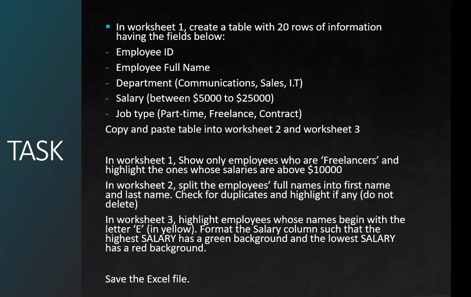
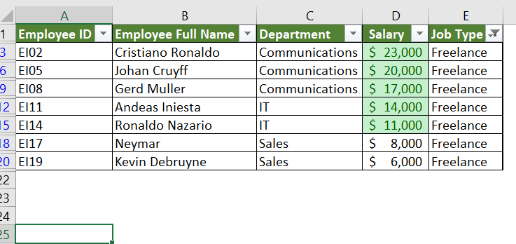
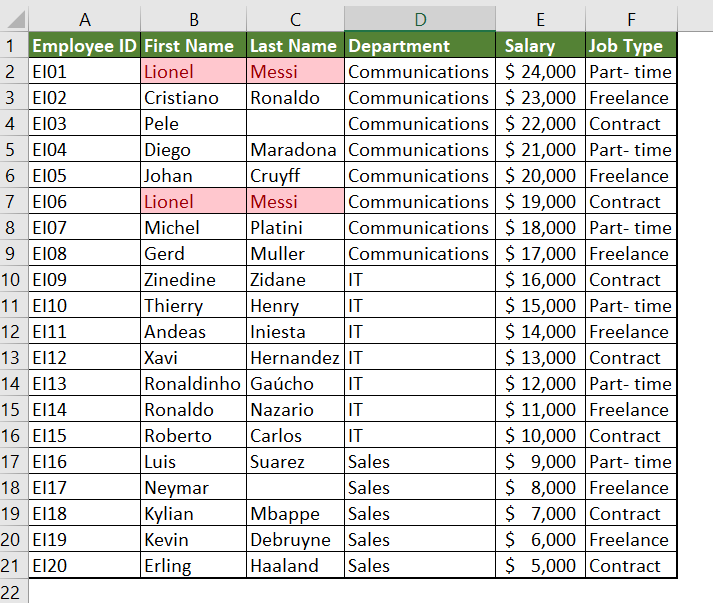
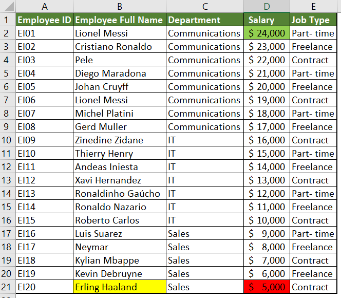
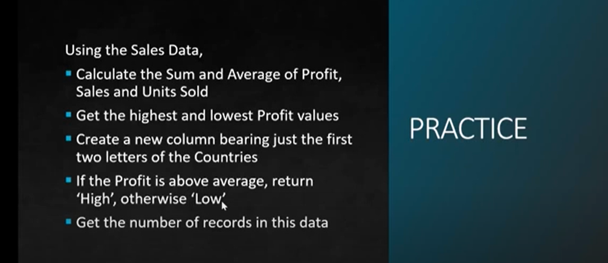
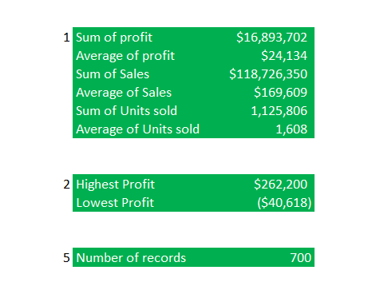
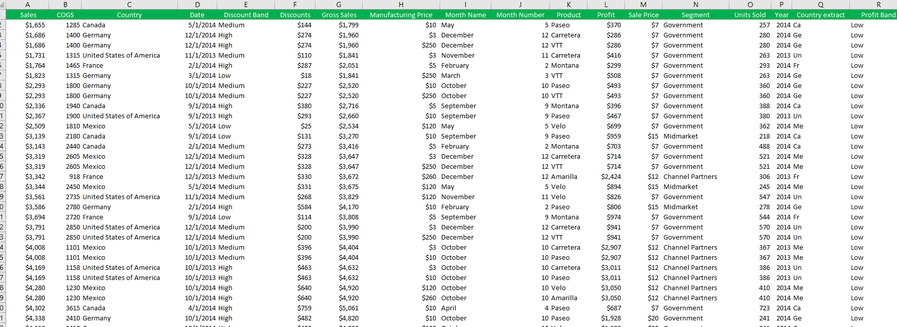
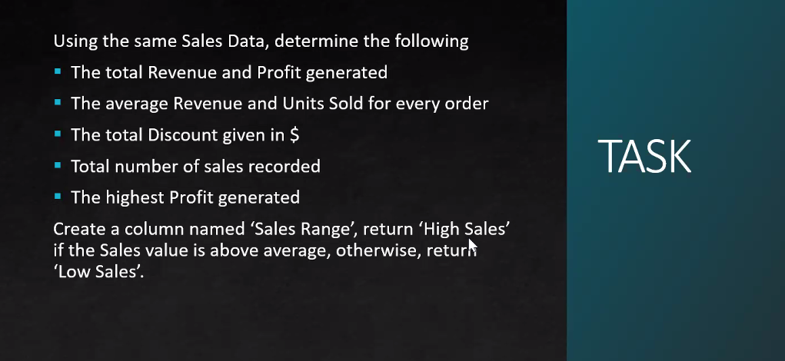
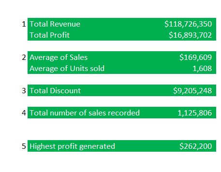
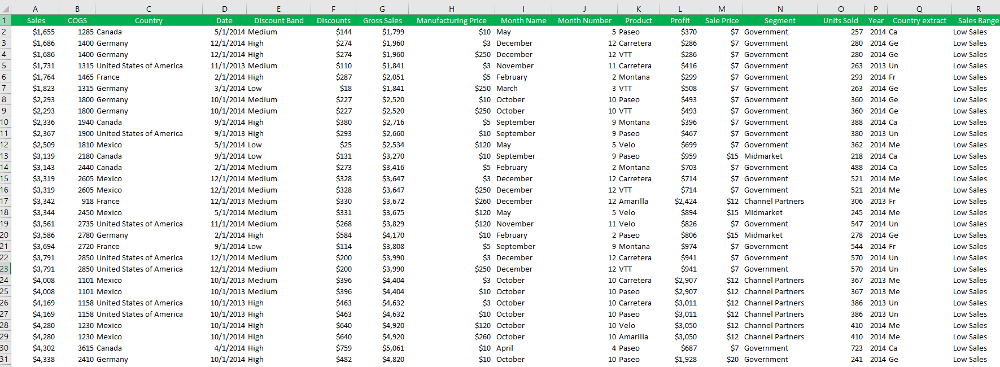

# Onochie Chukwuka Data Analysis Tasks and Practice

## Introduction
This is a report to show my answers to the questions from the two datasets given **_"Employee ID"_** and **_"Sales Data"_**. My answers include both the practice and the tasks given.

Task 1 - **Employee ID**
-
## Questions

## Answers
1. Show only employees who are 'Freelancers' and highlight the ones whose salaries are above $10,000
  
2. Split the employees full names into first name and last name. Check for duplicates and highlight if any (do not delete)

3. Highlight employees whose names begin with letter E (in yellow). Format the Salary column such that the highest SALARY has a green background and the lowest SALARY has a red background.

   
Practice - **Sales Data**
-
## Questions

## Answers

Task 2 - **Sales Data**
-
## Questions

## Answers

   
